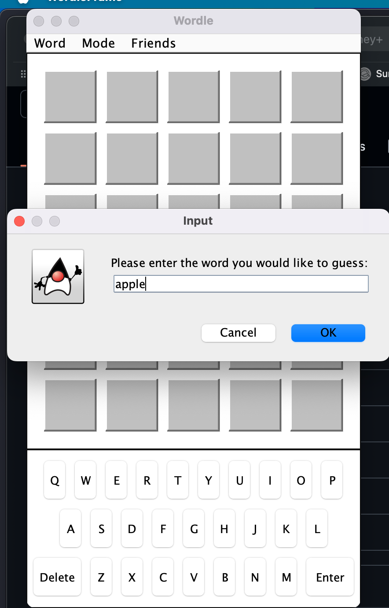
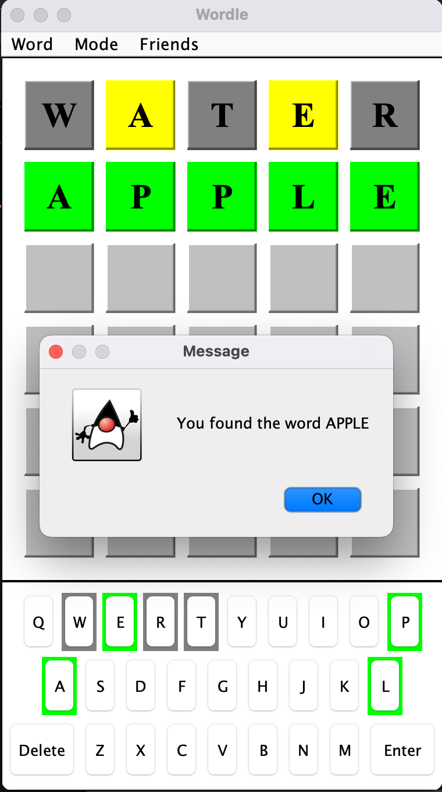
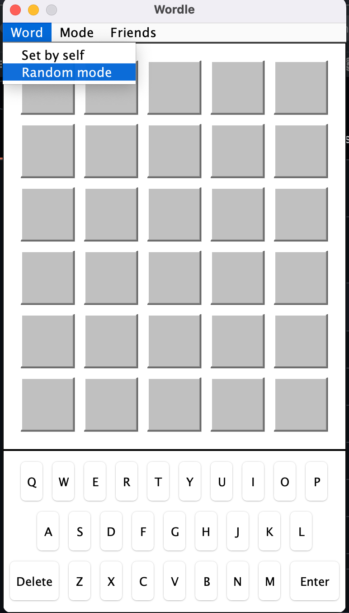
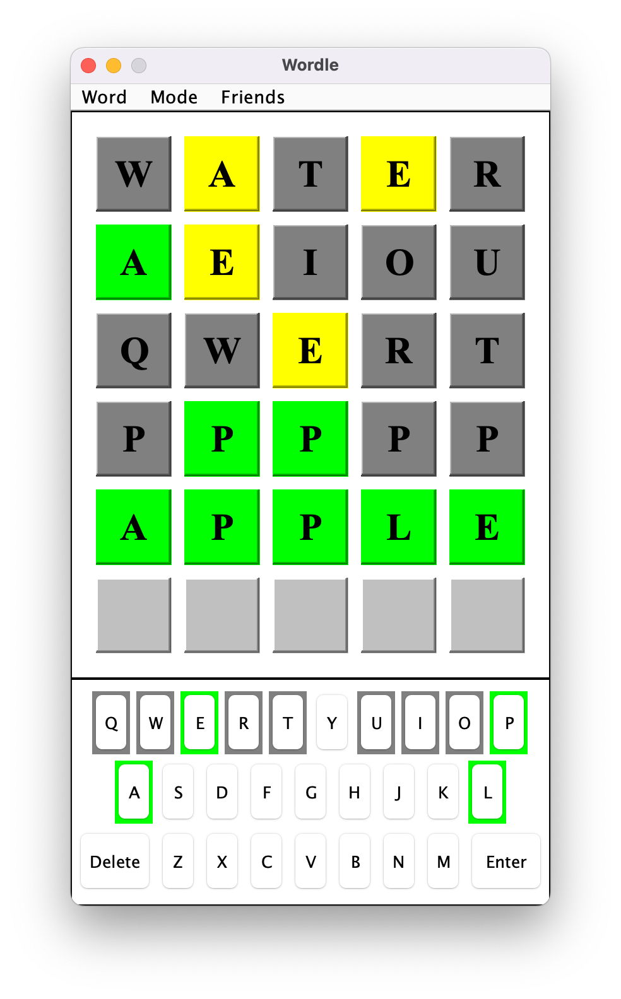

# Wordle Game

## description

this is a wordle game written in java that runs locally on windows, macos, and linux.

you can play wordle without an internet connection and even challenge your friends by setting custom answers.  
or, enjoy the classic wordle experience with a randomly selected answer from the local library.

## game modes

### 1. custom answer mode
set the answer yourself and let someone else use the same computer to guess it.

  

### 2. random mode
play solo with a randomly generated answer.

### 3. cheating mode
if wordle feels too hard, enable cheating mode. this lets you input any letters to reveal the answer.

  

you can switch back to the original mode anytime.

### 4. remote challenge mode
if your friends also have this game, you can generate an answer code and share it with them.  
they can paste the code into their game and play remotely with the same wordle challenge.

## default settings
when you start the game, it runs in **random mode** and **original mode** by default.

enjoy! 🎉  